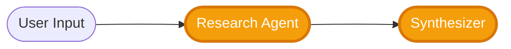

# 🟢 Beginner Track — ScholarAI (Research → Synthesis)

Welcome to the **Beginner Track** of the ScholarAI project! You’ll build a small, production-style **Agentic AI app** that:

* Uses **Tavily or SerpAPI** to search the web for **relevant sources** on a user’s topic,
* Passes cleaned snippets and links to a **Synthesizer** powered by the **OpenAI Agents SDK**, and
* Serves everything through a **Gradio** UI (with export to Markdown/JSON).

Beginner-friendly, but you’ll still learn API integration, tool design, prompt craft, and deploying an AI app.

---

## Agent Workflow

---

## 🎓 Weekly Breakdown

### ✅ Week 1: Setup & Exploration

* Create repo, venv, and `requirements.txt`.
* Add `.env` with keys: `OPENAI_API_KEY`, `TAVILY_API_KEY` **or** `SERPAPI_API_KEY`.
* Implement **minimal tools**:
  * `web_search(query, k=10)` → Tavily/SerpAPI wrapper returning `{title, url, snippet}`.
* Wire a **single Research Agent** (OpenAI Agents SDK) that:

  * Calls `web_search` tool,
  * Returns *top-N* curated sources.

---

### ✅ Week 2: Synthesis with LLM

* Add a **Synthesizer Agent** that:

  * Consumes curated results (snippets + links),
  * Produces **structured output**:

    * **TL;DR (≤120 words)**
    * **Key Findings** (bulleted, each with a citation)
    * **Conflicts & Caveats**
    * **Top 5 Links** (with why they matter)

* Exporter:

  * `to_markdown(report_obj) → report.md`
  * `to_json(report_obj) → report.json`

---

### ✅ Week 3: Testing, Polish & Deployment

* Build **Gradio** app:

  * Inputs: topic/question.
  * Output tabs: **Summary**, **Evidence Table**, **Sources**.
  * Buttons: **Copy TL;DR**, **Download .md**, **Download .json**.
* Prompt polish:

  * Add **style controls** (technical vs layperson).
  * Add **tone** (neutral, advisory).

**Deliverables**

* `app.py` (Gradio)
* `Dockerfile` (optional) or HF Spaces config
* Deployed demo link (Streamlit/Spaces acceptable if preferred)

---

## 🗒️ Project Timeline Overview

| Phase                              | General Activities                                               |
| ---------------------------------- | ---------------------------------------------------------------- |
| **Week 1: Setup & Exploration**    | Repo, env, API keys, search tool, Research Agent, caching        |
| **Week 2: LLM Synthesis Pipeline** | Synthesizer Agent, structure, citations, exporters               |
| **Week 3: Deployment**             | Gradio UI, prompt tuning, light eval, deploy to Spaces/Streamlit |

---

## 🚪 Where to Submit

Place your work in:

* `submissions/team-members/<your-name>/` (official team), or
* `submissions/community-contributions/<your-name>/` (open contributor).

See **CONTRIBUTING.md** for specifics.